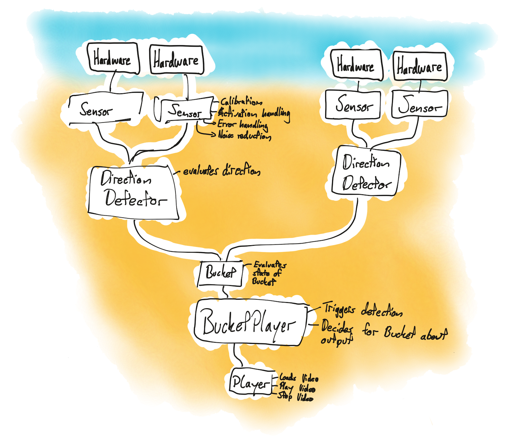

# Sonar Sensor Powered Person Detector
The Person Detector detects person in front of a row of sonar sensors. The systen can tell in between which sonar sensors a person is standing and in which direction he/she goes. The position, as well as the distance of the sensors are defining the "position buckets" a person can be.

## Example: Interactive storytelling installation
This system can be used in an interactive installation where a story is told through a row of displays and each display plays the dedicated next video in case a person stands in front of it. In this case, the sonar sensors are placed in between the displays, which therefore defines the "bucket" a person can stand in. If a person stands in front of a screen, that means the person is in a position bucket, which is recognized by the system. If the person moves now further to the left, the system will know from where the person came from (e.g. what has this person already seen) and would then show the next chronological chapter of the whole story.

## Architecture concept
The system is equipped with a Raspberry Pi Zero W and four Sonar sensors per bucket, two per each site. Each sonar sensor pair is responsible to detect the movement and the direction of a person. Two pairs together are then responsible to define, if a person went into a bucket, is still inside or already went our from a bucket. With multiple bucket-sensors combined, the system determines a "breadcrumb" system of a person, defining the chronological history of a person's experience in the whole installation.

